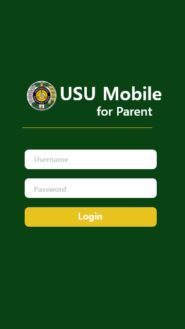
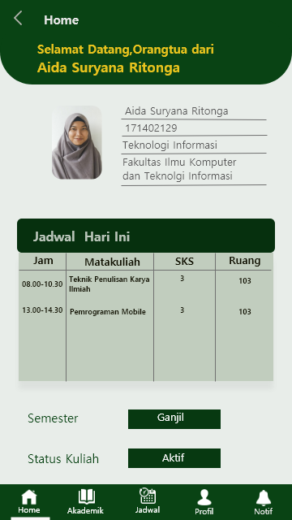
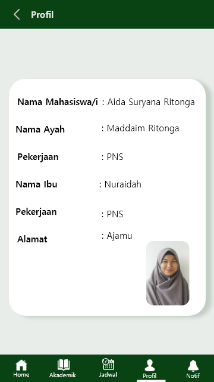
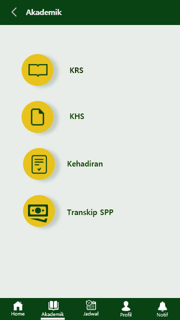
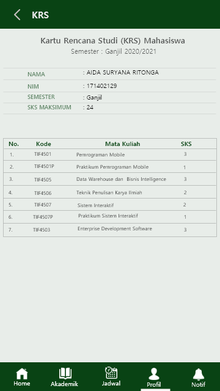
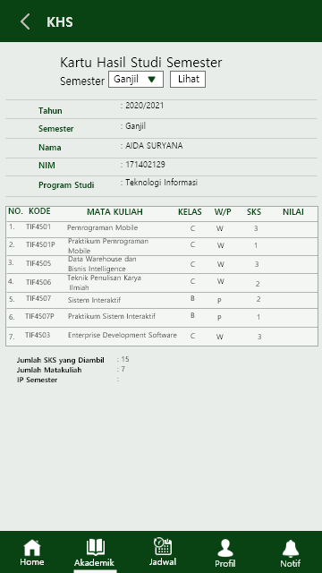
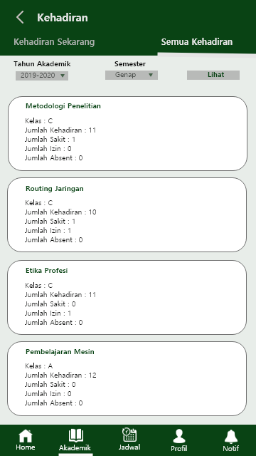
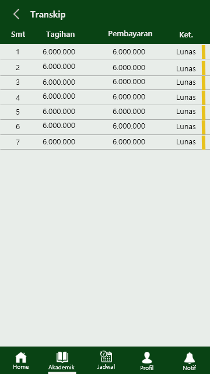
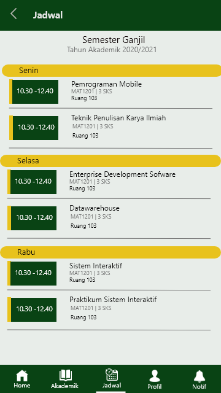
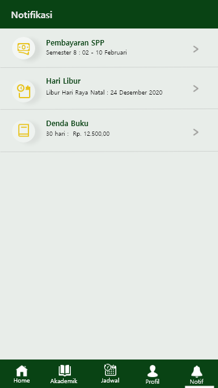

# USUMobileForParent

Aplikasi USU Mobile for Parent digunakan untuk membantu orangtua dalam memantau jadwal perkuliahan putra-putrinya sekaligus melakukan pengawasan.
Melalui aplikasi ini, orang tua mahasiswa juga dapat melihat aktifitas mahasiswa dikampus mulai dari nilai mahasiswa, data mahasiswa, info akademik, pembayaran, dan lain-lain.

## Konfigurasi Software

1. Sistem operasi Android 8.0
2. Bahasa Pemrograman Java, Json dan XML
3. Database Firebase

## Kelompok

1. Nia Ulan Sari - 171402045 
2. Eka Khairani Hutauruk - 171402045
3. Majidah Atmayana Purba - 171402120
4. Bella Savira - 171402144
5. Aida Suryana Ritonga - 171402129

## Desain UI/UX

